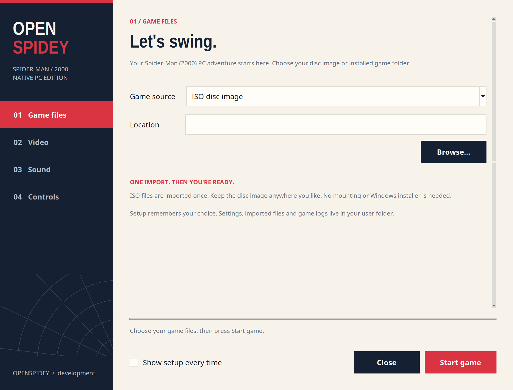

# OpenSpidey

**Your friendly neighborhood PC rebuild.**

OpenSpidey brings Spider-Man (2000) for PC to a native SDL3 and OpenGL engine.
Choose your game files, set up the picture, sound and controls, then press
**Start game**. The app remembers your choices.

[Download OpenSpidey](https://github.com/PatrikScully/OpenSpidey/releases)
· [What changed](CHANGELOG.md)
· [Build from source](docs/BUILDING.md)
· [Report a problem](https://github.com/PatrikScully/OpenSpidey/issues)

## Start playing

1. Download the **Linux** or **Windows** app from the release page.
2. Extract the whole archive into one folder.
3. Open **OpenSpidey** on Linux or **OpenSpidey.exe** on Windows.
4. Choose your Spider-Man (2000) **PC disc ISO**, or its installed game folder.
5. Pick your video, sound and control settings, then press **Start game**.

Setup imports the files it needs from an ISO. You do not need to mount the
disc, run the original installer or copy files by hand. The app reads your
original executable's data; it does not run code from that executable.
Only the supported original PC executable is accepted. Other editions,
regional builds or modified executables may need further support.

The next launch uses your saved settings. To change them, open
**OpenSpidey-Settings** on Linux or **OpenSpidey Settings.exe** on Windows.
You can also select **Show setup every time** in the setup window.

## Pick your settings

| Page | Options |
| --- | --- |
| Game files | PC disc ISO or installed folder |
| Video | Windowed, borderless fullscreen or fullscreen; resolution; antialiasing; texture filtering; smooth distant textures; VSync |
| Sound | Master volume, music and voices, sound effects |
| Controls | Modern controls, mouse sensitivity, vertical mouse inversion, opening movie skip |

The game keeps its original picture proportions, with black bars where
needed. Distant loaded buildings stay visible by default. Antialiasing and
world texture filtering reduce jagged edges and texture shimmer.

## Controls

| Action | Default control |
| --- | --- |
| Move | WASD or arrow keys |
| Look | Mouse |
| Jump | Space |
| Punch | Left mouse button |
| Shoot webs | Right mouse button |
| Select | Enter |
| Pause or skip an eligible scene | Escape |
| Release or capture the mouse | F1 |
| Quit | F12 |

Turn off **Modern controls** in setup to use the original keyboard layout.

## Downloads and requirements

| Download | Use |
| --- | --- |
| `openspidey-<version>-linux-x86_64.tar.gz` | Linux app for a 64 bit x86 desktop with glibc 2.35 or newer, such as Ubuntu 22.04 or newer |
| `openspidey-<version>-windows-x86_64.zip` | Native app for 64 bit Windows 10 or newer |
| `openspidey-<version>-windows-binkw32.zip` | Separate developer DLL for the original Windows game |
| Source archives | Build or study OpenSpidey and its bundled runtime |

The app packages include their setup launcher, SDL3 and the movie/audio
decoder. You do not need Python or a separate FFmpeg install to use them.
The game itself is 32 bit; the setup launcher is 64 bit.

The Linux package includes a 32 bit runtime and a Mesa software rendering
fallback. Hardware acceleration needs compatible 32 bit graphics drivers.
Software rendering can be slower. There is no native macOS build.

**You need your own PC game data.** Downloads contain no original game
assets. An installed folder must contain `SpideyPC.exe`, `data.pkr`,
`media.pkr` and `texture.dat`, and must be writable so the game can load
archives and save progress.

## Saves, settings and logs

ISO imports, saves and game logs are kept in your user data folder. Updating
the app or choosing another ISO preserves the imported game's `save` folder.
An installed folder remains the game's working folder and holds its saves.

| System | Settings | Imported game and logs |
| --- | --- | --- |
| Linux | `~/.config/openspidey/settings.json` | `~/.local/share/openspidey/` |
| Windows | `%APPDATA%\OpenSpidey\settings.json` | `%LOCALAPPDATA%\OpenSpidey\` |

Linux also follows `XDG_CONFIG_HOME` and `XDG_DATA_HOME`. Once an ISO has been
imported, its cached files can be used even if the ISO is moved. A failed
game run shows the path to its log. Include that log, your map and the last
action you took when reporting a problem.

## Current progress

This is a **development preview**. Rendering, player controls, thug behavior,
web effects, sound, dialogue and cinematics have advanced since v0.0.2.
The full game restoration and matching decompilation are still unfinished.

The latest Linux gameplay checkpoint loaded **68 map entries and 23 training
configurations** and checked short idle gameplay. Separate tests checked
melee attacks, web balls, tug release, camera turns, audio and texture
filtering. These checks do not mean every mission, boss, spawn wave or
training objective has been completed. Police AI and other game functions
still need work. The native Windows app passed setup, movies, main-menu
and short level-one checks under Wine. It still needs testing on Windows
hardware and across complete missions.

Detailed results are in the [gameplay checkpoint](tests/gameplay/checkpoints/2026-10-01.json)
and [test scenarios](tests/gameplay/scenarios.json).

## Development and credits

Read [the build guide](docs/BUILDING.md) and [contribution guide](CONTRIBUTING.md)
to work on the engine or decompilation. CI builds native Linux and Windows
apps and checks the separate original-game DLL. Runtime libraries and their
licenses are listed in [the packaging notes](packaging/THIRD_PARTY.md).

OpenSpidey is built on [krystalgamer/spidey-decomp](https://github.com/krystalgamer/spidey-decomp).
Credit for the original decompilation project, its tools and reverse
engineering work belongs to krystalgamer and its contributors. This project
continues that work with a native app and uses the original binary as a
reference. AI coding agents assist with implementation and testing.

Spider-Man (2000) was made by Neversoft and ported to PC by LTI Gray Matter.
Spider-Man and the original game assets belong to their respective owners.
